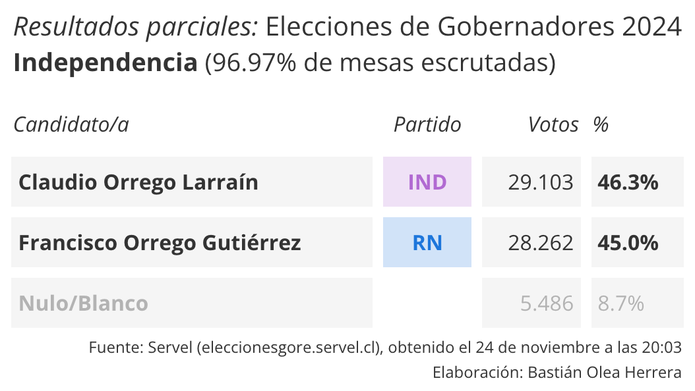
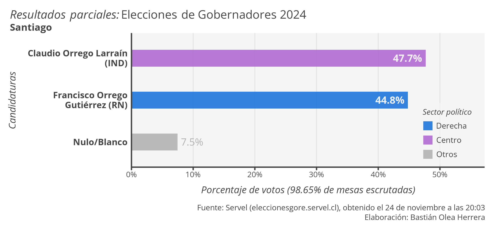
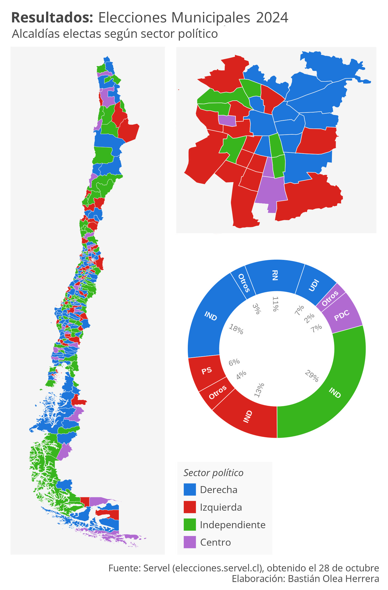
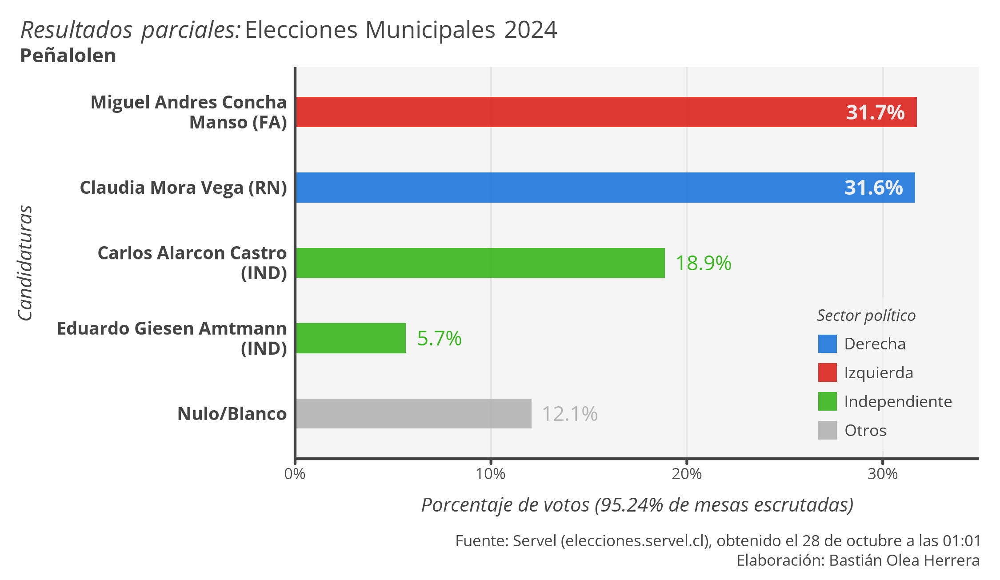
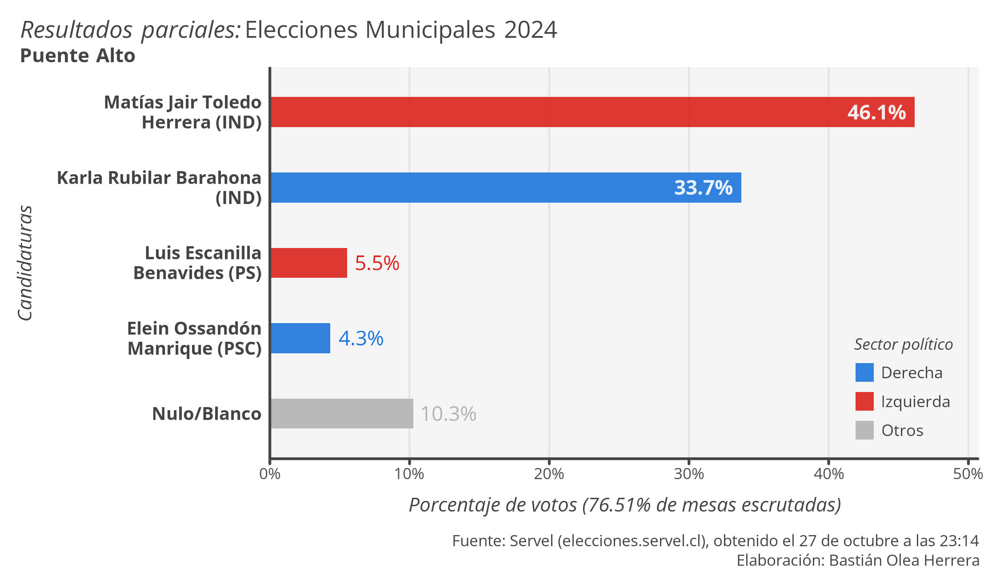
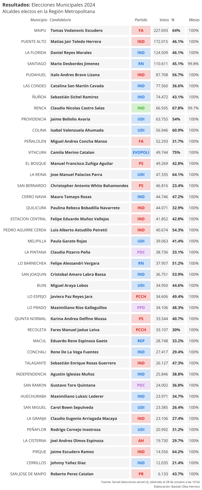
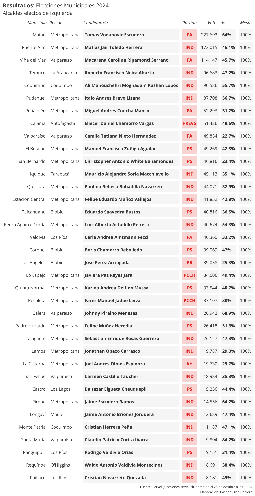

# Servel scraping votaciones

Flujo de R que scrapea datos desde el Servel, limpia los datos, y retorna visualizaciones en gráficos y tablas.

----

## Elecciones Regionales 2024: Gobernadores regionales

Por las elecciones de Gobernadores de 2ª vuelta, nuevamente hice una pequeña cobertura en tiempo real de los resultados electorales. 

Modifiqué el sistema de web scrapping y generación automática de gráficos y tablas que usé para las elecciones regionales de octubre, esta vez enfocándome en resultados comunales y ventajas porcentuales. En menos de media hora ya había adaptado el sistema de la elección anterior para obtener los datos nuevos, ubicados en un sitio distinto, y adaptados a una elección de características diferentes. Mientras los datos se iban scrapeando automáticamente, pude dedicarme a desarrollar nuevas visualizaciones para presentar los resultados, conectar estas visualizaciones al flujo de trabajo, y empezar a obtenerlas de forma automática.

Lamentablemente para mi (pero afortunadamente para el Servel) el conteo fue extremadamente rápido, así que solo pude hacer 3 o 4 actualizaciones de datos/visualizaciones y los conteos ya habían llegado a sobre el 95% de mesas escrutadas 🥲

Es demasiado satisfactorio cuando se llega a un flujo de trabajo y procesamiento de datos donde solo se necesita especificar uno o dos parámetros, presionas ejecutar, y el sistema corre solo, entregándote resultados unos segundos más tarde con el sonido de una campanita. Y gracias a un desarrollo precabido, es posible tomar sistemas que fueron desarrollados para un fin, y adaptarlos para otro nuevo objetivo.

Todo el sistema de obtención de datos y visualización fue desarrollado en R.

----

## Elecciones Municipales 2024: Alcaldes

Con motivo de las elecciones municipales, estuve generando algunas visualizaciones ”en tiempo real” de los resultados de las elecciones de alcaldías. 

Los datos de conteo de votos los fui obteniendo minuto a minuto mediante web scraping con {RSelenium}, que permite programar un navegador web para que interactúe con un sitio como si fuera humano. Entonces, el navegador robot (marioneta, le llaman) iba apretando todos los botones, sin intervención de mi parte, para encontrar y copiar los resultados de cada comuna del país.

Los nuevos resultados llegaban con frecuencia, así que había que echar a correr el proceso bajo presión, cada 10 minutos aprox. Todo iba bien: presionaba ejecutar, el proceso pasaba por todas las comunas, limpiaba los datos y retornaba visualizaciones. Hasta que, en la mitad del conteo, el sitio del Servel cambió! Por algún motivo, cambiaron a una versión similar del sitio, pero que internamente funcionaba distinto, entonces se desconfiguró todo el web scraping. Tuve que luchar contra el tiempo para reestablecerlo (terrible para mi, porque estaba aprendiendo Selenium 😭). Lo otro que me jugó en contra fue que no se me ocurrió automatizar la redacción de textos y posteo en redes sociales, que al final fue lo que me quitó más tiempo 😒

También faltó hacer visualizaciones más entretenidas, pero se hizo lo que se pudo para una idea que salió a la rápida. Es gratificante hacer andar un flujo largo de procesamiento de datos solo con un par de comandos, desde la obtención de los datos hasta que te arroja decenas o cientos de salidas ✨

Para los nerds, usé {RSelenium} para un script que recibía un vector de comunas e iteraba por ellas con {furrr}, y retornaba una lista con la tabla de resultados, el párrafo de las mesas escrutadas, y el nombre de la comuna. Luego, otro script de R cargaba el scraping más reciente y limpiaba los datos, calculaba porcentajes, coincidía partidos con sectores políticos, corregía a "independientes" que en realidad tienen sector político claro, arreglaba nombres (Servel usa eñes pero no tildes, por alguna razón), interpretaba el texto de las mesas como cifras individuales, sumaba votos nulos y blancos, entre otras cosas. Después tenía un script desde el que comandaba todos los demás pasos, que para partir borraba todas las salidas antiguas, y según las comunas que le pedía, generaba nuevos gráficos/tablas en una carpeta nueva. Sobre los gráficos y tablas, nada interesante, salvo que el alto de los gráficos dependía de la cantidad de candidatos, para que siempre mantuvieran espaciados correctos y no se deformaran si eran muchos o muy pocos candidatos/as.

Finalmente, el flujo de procesamientos de datos en R generó 238 gráficos y 240 tablas, de las cuales les comparto algunas. Esa fue mi experiencia intentando generar reportes en tiempo real sobre datos de elecciones. Para la siguiente votación espero tener algo más elaborado!

## Alcaldes electos en la Región Metropolitana

## Alcaldes de izquierda electos
